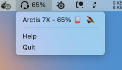
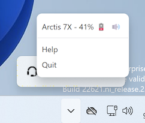

# Arctis Monitor

This Electron application will create a Tray application to show the current battery level and some other information about the headset.





## [See the Releases Page](https://github.com/richrace/arctis-monitor/releases)

[Releases page for downloads for macOS, Windows and Linux](https://github.com/richrace/arctis-monitor/releases).

## Supported Headsets:

Supported headsets are provided by [Arctis USB Finder](https://github.com/richrace/arctis-usb-finder). They are:

* Arctis Pro Wireless
* Arctis 7 2017
* Arctis 7 2019
* Arctis Pro 2019
* Arctis Pro GameDac
* Arctis 9
* Arctis 1 Wireless
* Arctis 1 Xbox
* Arctis 7X
* Arctis 7 Plus
* Arctis 7P Plus
* Arctis 7X Plus
* Arctis 7 Destiny Plus
* Arctis Nova 7
* Arctis Nova 7 Diablo IV
* Arctis Nova 7X
* Arctis Nova 7X V2
* Arctis Nova 7P
* Arctis Nova Pro Wireless
* Arctis 7P

If yours isn't on the list follow the instructions on the [Arctis USB Finder's Probe](https://github.com/richrace/arctis-usb-finder#probe)

## Debug

### Windows

To get the debug menu you have to press the <kbd>Alt</kbd> key at the same time you click, and then right click to
load the menu.

#### Install Location

File explorer: `%localappdata%\arctis-monitor` double click `arctis-monitor`.

#### Force

To force load a refresh of headphones press the <kbd>⇧ Shift</kbd> key at the same time you click, and then right click to
see any changes.

### macOS

To get the debug menu you have to press the <kbd>⌥ Option</kbd> key at the same time you click the menu.

#### Force

To force load a refresh of headphones press the <kbd>⇧ Shift</kbd> key.

## Development

### Dependency

The logic to find the headphones is abstracted to this repo / npm package [arctis-usb-finder](https://github.com/richrace/arctis-usb-finder).

You can checkout that package if you want to edit it, and change the npm dependency to the directory you've cloned it
to e.g. `"arctis-usb-finder": "file:../arctis-usb-finder"`. If you make a change, as it's written in TypeScript you must
build it first and restart this application to refresh the code.

### This electron app

Clone this repo

Run
```
npm install
```

and then
```
npm start
```

As it's written in TypeScript you will need to kill and restart start after each change.

## Credits

* Icons made by [Freepik](https://www.flaticon.com/authors/freepik "Freepik") from [www.flaticon.com](https://www.flaticon.com/ "Flaticon")
