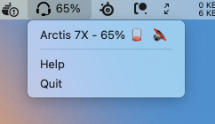

# Arctis Monitor

This Electron application will create a Tray application to show the current battery level and some other information about the headset.



## [See the Releases Page](https://github.com/richrace/arctis-monitor/releases)

[Releases page for downloads for macOS, Windows and Linux](https://github.com/richrace/arctis-monitor/releases).

## Supported Headsets:

Supported headsets are provided by [Arctis USB Finder](https://github.com/richrace/arctis-usb-finder). They are:

* Arctis 7 2019
* Arctis 7 2017
* Arctis Pro
* Arctis 1 Wireless
* Arctis 9
* Arctis 7X
* Arctis 7+ 2022

If yours isn't on the list follow the instructions on the [Arctis USB Finder's Probe](https://github.com/richrace/arctis-usb-finder#probe)

## Development

Clone the repo

Run
```
npm install
```

and then
```
npm start
```

## Credtis

* Icons made by [Freepik](https://www.flaticon.com/authors/freepik "Freepik") from [www.flaticon.com](https://www.flaticon.com/ "Flaticon")
